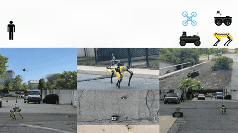

# spine multi

SPINE-HT coordinates a team of heterogeneous robots (ground and aerial)
for missions described in natural language, grounding an LLM in the team's real-world
capabilities. See the paper: [SPINE-HT (IROS 2026)](https://zacravichandran.github.io/SPINE-HT/).

<p align="center">
  
</p>

The pipeline works in three stages:

1. **Generation** (`src/spine_multi/decomp`) — an LLM turns a natural-language mission
   and the team's capability specification into grounded subtasks drawn from a fixed
   navigation/inspection/mapping API (e.g. `ugv_navigate`, `ugv_inspect`,
   `ugv_map_region`, `ugv_explore_to_coord`), which are validated for feasibility.
2. **Assignment** (`src/spine_multi/allocation`) — subtasks are distributed to robots
   by solving an LP over per-platform capabilities (e.g. traversability, perception)
   for platforms like Jackal, Husky, Spot, and UAV.
3. **Refinement** (`src/spine_multi/spine`, referred to as execution in the code) —
   each robot runs a SPINE loop that queries an LLM against its live semantic graph to
   pick the next grounded action (`explore_region`, `map_region`, `inspect`, `clarify`,
   `goto`, `answer`, `extend_map`, `replan`), collecting feedback online and adapting
   assignments as conditions change.

`src/spine_multi/baselines` contains an alternate LLM-coordinator implementation used
for comparison against SPINE.

## Installing

### First install the python package in your ros ws
```sh
cd ~/ws/src
git clone https://github.com/ZacRavichandran/spine-multi && cd spine-multi
python -m pip install -e .
cd ..
```

### Now install the ros components

```sh
vcs import src < ./spine-multi/ros/spine_multi_ros/spine_multi_https.rosinstall
colcon build --symlink-install
source install/setup.sh
```

(use `spine_multi_git.rosinstall` instead if you prefer cloning over SSH)


Note that this repo must be installed on both your basestation, which runs the SPINE-HT coordinator, and each robot.

## Running

### Coordinator

`multi_spine.launch.py` is the top-level entry point, typically run on the basestation.
It brings up the `spine_multi_node`, which reads a per-robot config
(`robot_config`, a `spine_multi.yaml`) and optionally starts the `mocha` basestation
comms stack (`use_mocha`).

```sh
ros2 launch spine_multi_ros multi_spine.launch.py robot_config:=<PATH_TO_CONFIG> use_mocha:=True
```

Each robot runs its own autonomy server (see [Platforms](#platforms) and
[Local autonomy](#local-autonomy) below), which connects back to `spine_multi_node`.

### Platforms

Jackal, Husky, and Spot all launch through the same pattern: a namespaced group that
brings up static transforms, navigation, vision, and a platform-specific autonomy
server, then optionally recording and `mocha`.

```sh
ros2 launch spine_multi_ros jackal_launch_all.launch.py
ros2 launch spine_multi_ros husky_launch_all.launch.py
ros2 launch spine_multi_ros spot_launch_all.launch.py
```

What differs per platform:

| | Jackal | Husky | Spot |
|---|---|---|---|
| Static transforms | `clearpath_static_transforms.launch.py` | `clearpath_static_transforms.launch.py` | `spot_static_transforms.launch.py` |
| Navigation | nav2 (`nav2_jackal_stvox.yaml`) | nav2 (`nav2_husky.yaml`) | none |
| Vision | `vision.launch.py` | `vision_clearpath.launch.py` (off by default, `use_vision`) | `vision_clearpath.launch.py` (always on) |
| Autonomy server | `clearpath_autonomy_server.py` | `clearpath_autonomy_server.py` | `spot_autonomy_server.py` |
| Recording | `record_jackal.launch.py` | `record_husky.launch.py` | `record_spot.launch.py` |

`use_mocha` (basestation comms) defaults to `true` on all platforms.

These launch files **do not** launch sensors or control drivers. These must be launched separately, depending on your setup.

### Local autonomy

Each robot's local autonomy stack has three parts:

- **Navigation** — Jackal and Husky drive through the standard Nav2 stack
  (`navigation_launch.py` with `nav2_jackal_stvox.yaml` / `nav2_husky.yaml`), with
  Husky adding a `safety_controller` and `twist_converter.py` between Nav2's output
  and the platform `cmd_vel`. Spot has no Nav2 include; motion goes through
  `spot_autonomy_server.py`, which computes an SE2 goal and drives Spot's own
  client-side navigation directly. All three run a platform autonomy server
  (`clearpath_autonomy_server.py` for Jackal/Husky, `spot_autonomy_server.py` for
  Spot) that executes the behaviors SPINE requests.
- **Mapping** — each robot builds and owns its own semantic graph on-robot: the
  autonomy server (`clearpath_autonomy_server.py` / `spot_autonomy_server.py`) holds a
  `GraphHandler` (`src/spine_multi/spine/mapping/graph_util.py`), updated from vision
  object tracks (`vision.launch.py` / `vision_clearpath.launch.py`) and republished for
  visualization/reporting. This is separate from `groundgrid` (`ground_grid.launch.py`,
  used by Jackal/Husky), which builds a terrain/elevation grid for Nav2's local
  costmap, not the semantic graph.
- **Communications with the coordinator** — the autonomy server parses behavior
  requests from and reports behavior results, its local graph, and local costmap up
  to the basestation's `spine_multi_node` (which merges per-robot graphs into one
  aggregate graph), over topics defined in each robot's config
  (`ros/spine_multi_ros/config/spine_configs/spine_multi_<robot>.yaml`, e.g.
  `graph_viz_topic`, `track_topic`, `behavior_request_pub`, `behavior_result_sub`).
  This traffic rides the `mocha` cross-machine bridge between each robot and the
  basestation (`domain_bridge` is an alternate bridging path, currently unused).

### Topics

Per-robot topic names are namespaced (via `subscription_prefix`/`namespace`) and set
per-robot in `spine_multi_<robot>.yaml` (e.g. `ros/spine_multi_ros/config/spine_configs/spine_multi_jackal.yaml`).
For a robot registered under namespace `/io`:

| Direction | Coordinator (`spine_multi_node`) | Robot (`<robot>_autonomy_server`) |
|---|---|---|
| Basestation → robot (task dispatch) | publishes `behavior_request_pub` (e.g. `/to_io/behavior_request`) | subscribes `behavior_request` |
| Robot → basestation (task ack) | subscribes `behavior_request_ack_sub` (e.g. `/io/behavior_request_ack`) | publishes `behavior_request_ack` |
| Robot → basestation (task result) | subscribes `behavior_result_sub` (e.g. `/io/behavior_result`) | publishes `behavior_result` |
| Basestation → robot (result ack) | publishes `behavior_result_ack_pub` (e.g. `/to_io/behavior_result_ack`) | subscribes `behavior_result_ack` |
| Robot → basestation (semantic graph viz) | — | publishes `graph_viz_topic` (e.g. `/io/graph_viz`) |
| Robot → basestation (perception input) | — | subscribes `track_topic` (e.g. `/io/grounding_dino_node/tracks`) |
| Robot → basestation (local costmap) | — | subscribes `local_costmap_topic` (e.g. `/io/local_costmap/costmap_throttled`) |

The coordinator itself exposes:
- `/spine_multi/mission` and `/spine_multi/interrupt` — `Mission` services for
  starting or interrupting a mission from the basestation.
- `graph` — the coordinator's aggregate semantic graph (merged from all robots), as a
  `String` (JSON) topic, published on a 1 Hz timer.
- `/basestation/graph_viz` — visualization of the aggregate graph.
- `/titan/graph` — subscribed for incoming UAV graph updates (parsed and merged into
  the aggregate graph).

### Sensor & control topics

Below the SPINE-level topics, each platform wires its own sensor and motion topics.

| | Jackal | Husky | Spot |
|---|---|---|---|
| Vision input | camera topics from `vision_ros2/config/jackal.yaml` | `/zed/zed_node/left/image_rect_color`, `.../depth/depth_registered`, `.../depth/camera_info` | `/prometheus/frontleft/color/image_raw`, `.../depth/image_rect`, `.../color/camera_info` |
| Motion command | Nav2 `cmd_vel_topic` → `platform/cmd_vel`, routed through `convert_vel_to_joy.py` (`/cmd_vel_nav` → `/joy`) | Nav2 `cmd_vel_topic` → `platform/cmd_vel`, routed through `twist_converter.py` (`cmd_vel_nav` → `autonomous/cmd_vel`) and `safety_controller` (`autonomous/cmd_vel`, `auto_mode/cmd_vel`) | no `cmd_vel` topic — motion goes through Spot's own navigation/trajectory service calls in `spot_autonomy_server.py` |
| Odometry | local `/dlio/odom_node/odom`, global `/glider/odom` (via `goal_frame_converter.py`) | default from `vision_clearpath.launch.py` (not remapped) | `/dlio/odom_node/odom` remapped to `/odom`; `spot_autonomy_server.py` also republishes `/odom` at 10 Hz |

All three publish static frames (`map` → `map_<robot_name>`, offset by `start_x`/
`start_y`) to `/tf_static` via `clearpath_static_transforms.launch.py` (Jackal/Husky)
or `spot_static_transforms.launch.py` (Spot).

These sensor/control topics are internal to each platform's autonomy stack — only the
topics in the previous section cross the `mocha` bridge to the basestation.
